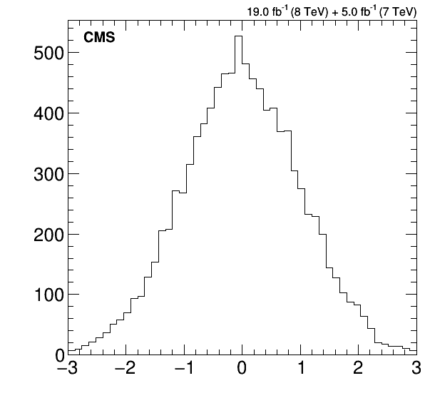
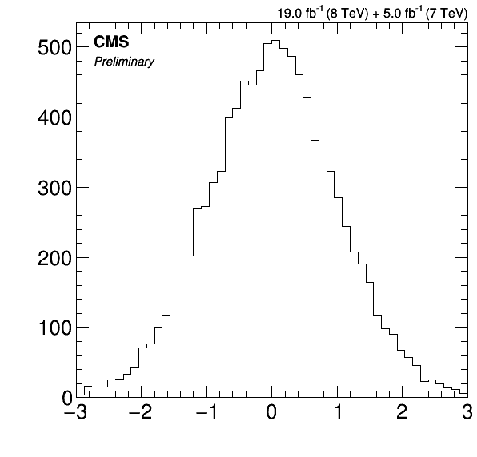
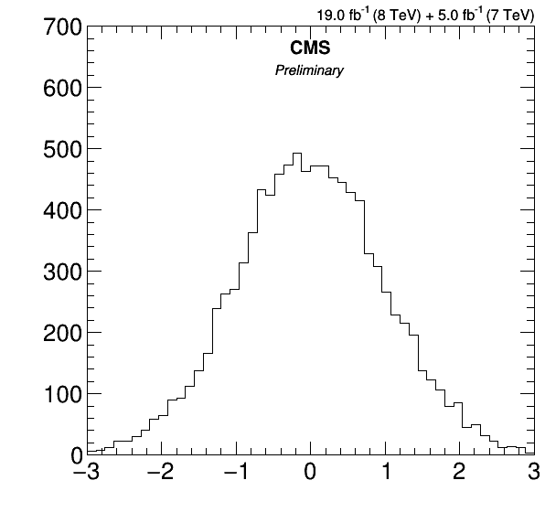
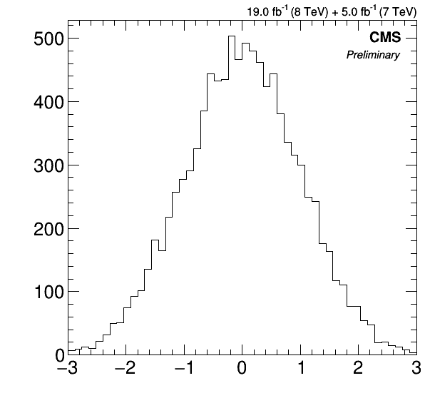
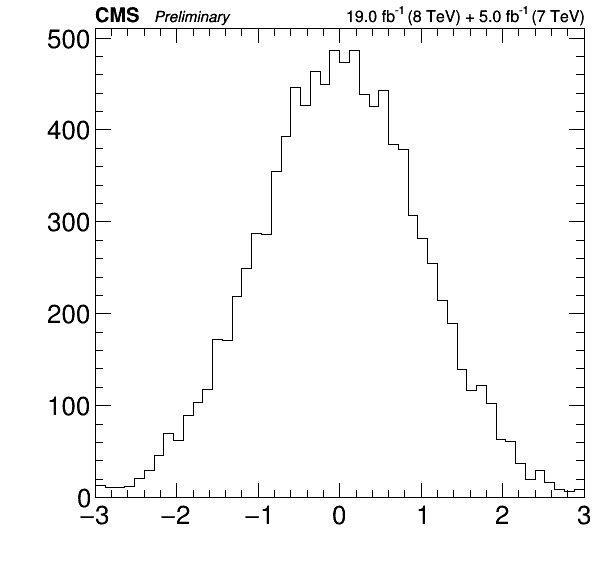

# cms_figure

The CMS Publication Committee (PubComm) has a set of [guidelines](https://twiki.cern.ch/twiki/bin/view/CMS/Internal/FigGuidelines) regarding how figures should appear in more official settings. To that end, they provide a ROOT C++ macro for drawing figure labels that is accompanied by an all too literal translation into Python. Having worked on restyling figures for publication, I decided to craft a more user-friendly experience. The end result is this unofficial cms_figure package that features:

* A `TDRStyle` context manager that helps with switching to and from the official plotting style.
* A `draw_labels` utility function that positions and draws figure labels on the active canvas.
* The `CMSLabel` and `LuminosityLabel` classes for power users that need to customize their figure labels beyond the default cases covered by `draw_labels`.
* And docstrings. Docstrings everywhere!

## Installation

The only prerequisites are Python and ROOT with Python bindings enabled (PyROOT).

* The easiest way to install is through pip:

  ```bash
  pip install cms_figure
  ```

* If for some reason pip cannot be used, please download the source of the desired [release](https://github.com/swang373/cms_figure/releases), unpack it, and install it manually:

  ```bash
  curl -OL https://github.com/swang373/cms_figure/archive/<version>.tar.gz
  tar -zxf <version>.tar.gz
  cd cms_figure-<version>
  python setup.py install
  ```

* If setuptools is not available, then the previously mentioned manual installation won't work. At this point, dropping the cms_figure package into your working directory is a solution, assuming the prerequisites are satisfied.

  ```bash
  curl -OL https://github.com/swang373/cms_figure/archive/<version>.tar.gz
  tar -zxf <version>.tar.gz
  cp -r cms_figure-<version>/cms_figure <working directory>
  ```

To check that the installation succeeded, try running the following lines in a Python interpreter session:

```python
import cms_figure
cms_figure.__version__
```

The correct version number should appear in the terminal .

## Usage Examples

In lieu of an API reference, I'll introduce the features of the package through code snippets (which assume that ROOT and cms_figure have been imported). All of the classes and functions have detailed docstrings, so you can pass them to the builtin `help` function in a Python interpreter if you want to know more.

### 1. Plotting with the CMS Physics TDR Style

The official plotting style for CMS figures is the physics technical design report (P-TDR) style. The `TDRStyle` context manager provides a Pythonic way of setting the plotting style using `with` statements:

```python
with cms_figure.TDRStyle():
    canvas = ROOT.TCanvas()
    # Draw stuff here...
```

Upon entering the context, a style object is created and set as the global ROOT plotting style. Once inside the context, the properties of the canvas and any other objects drawn will conform to the P-TDR style. When exiting the context, the global ROOT plotting style is reset back to whatever style was being used prior to entering the context.

If the P-TDR style needs to be tweaked for aesthetic reasons, the user can modify the style object returned by the context manager:

```python
with cms_figure.TDRStyle() as style:
    style.SetTitleXOffset(1.2)
    style.SetTitleSize(0.05)
    canvas = ROOT.TCanvas()
    # Draw stuff here...
```

As a subclass of `ROOT.TStyle`, the style attributes can be modified using the inherited "Set" methods documened [here](https://root.cern.ch/doc/master/classTStyle.html). I was thinking of turning the style attributes into Python properties, but didn't get to it yet. If you would like this feature, please bug me about it.

### 2. Drawing the CMS and Luminosity Labels

The official plotting style for CMS figures has specific requirements for displaying the CMS name, luminosity, and center-of-mass information. The `draw_labels` function takes care of all the relative positioning, font choices, and font sizes so the user needs only specifiy their preferred location and text for the labels.

The `lumi_text` argument is the only required argument and sets the luminosity label's text without restriction, though the user is responsible for ensuring that it conforms to the PubComm standard. The `cms_position` argument sets the position of the CMS name on the canvas and also affects the relative positioning of any `extra_text` set by the user.

The default behavior places the CMS name on the upper left corner inside the frame:

```python
with cms_figure.TDRStyle():
    canvas = ROOT.TCanvas()
    hist = ROOT.TH1F('normal', '', 50, -3, 3)
    hist.FillRandom('gaus', 10000)
    hist.Draw('hist')
    cms_figure.draw_labels('19.0 fb^{-1} (8 TeV) + 5.0 fb^{-1} (7 TeV)')
    canvas.Draw()
```

<p align="center">
  
</p>

Let's add some additional writing to make it more interesting:

```python
with cms_figure.TDRStyle():
    canvas = ROOT.TCanvas()
    hist = ROOT.TH1F('normal', '', 50, -3, 3)
    hist.FillRandom('gaus', 10000)
    hist.Draw('hist')
    cms_figure.draw_labels('19.0 fb^{-1} (8 TeV) + 5.0 fb^{-1} (7 TeV)', extra_text='Preliminary')
    canvas.Draw()
```

<p align="center">
  
</p>

The other common positions are:

* center,

  ```python
  with cms_figure.TDRStyle():
      canvas = ROOT.TCanvas()
      hist = ROOT.TH1F('normal', '', 50, -3, 3)
      hist.FillRandom('gaus', 10000)
      hist.SetMaximum(700)
      hist.Draw('hist')
      cms_figure.draw_labels(
          lumi_text='19.0 fb^{-1} (8 TeV) + 5.0 fb^{-1} (7 TeV)',
          cms_position='center',
          extra_text='Preliminary',
      )
      canvas.Draw()
  ```
  
  <p align="center">
    
  </p>

* right,

  ```python
  with cms_figure.TDRStyle():
      canvas = ROOT.TCanvas()
      hist = ROOT.TH1F('normal', '', 50, -3, 3)
      hist.FillRandom('gaus', 10000)
      hist.Draw('hist')
      cms_figure.draw_labels(
          lumi_text='19.0 fb^{-1} (8 TeV) + 5.0 fb^{-1} (7 TeV)',
          cms_position='right',
          extra_text='Preliminary',
      )
      canvas.Draw()
  ```
  
  <p align="center">
    
  </p>

* and outside.

  ```python
  with cms_figure.TDRStyle():
      canvas = ROOT.TCanvas()
      hist = ROOT.TH1F('normal', '', 50, -3, 3)
      hist.FillRandom('gaus', 10000)
      hist.Draw('hist')
      cms_figure.draw_labels(
          lumi_text='19.0 fb^{-1} (8 TeV) + 5.0 fb^{-1} (7 TeV)',
          cms_position='outside',
          extra_text='Preliminary',
      )
      canvas.Draw()
  ```
  
  <p align="center">
    
  </p>

**Under Construction**
